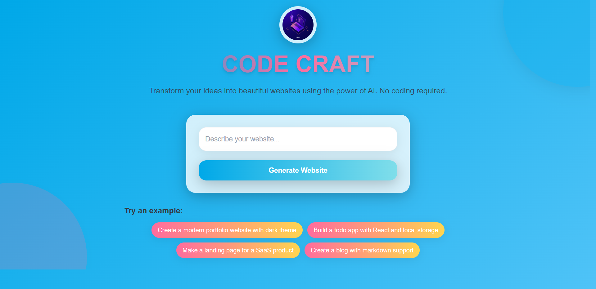
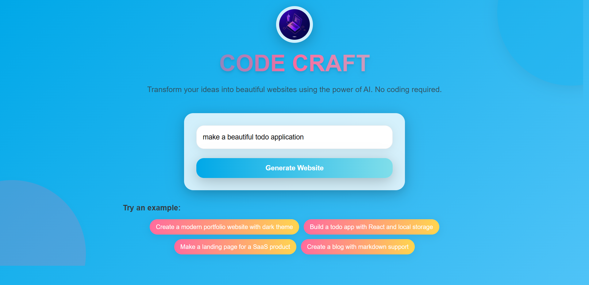
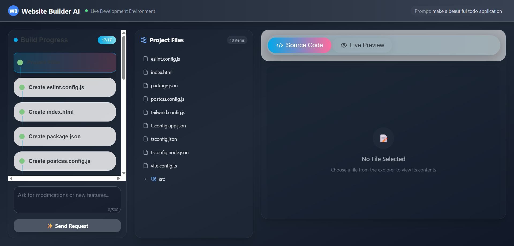
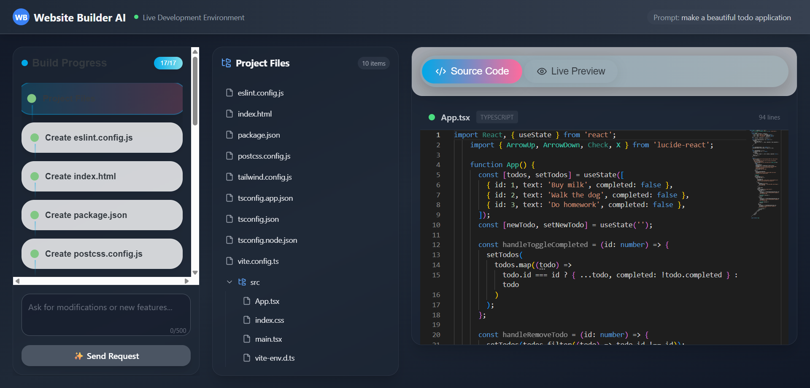
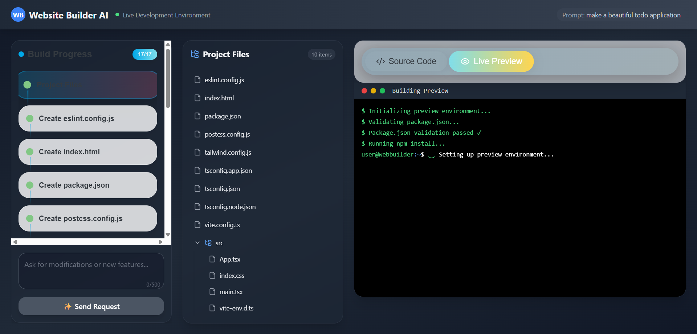
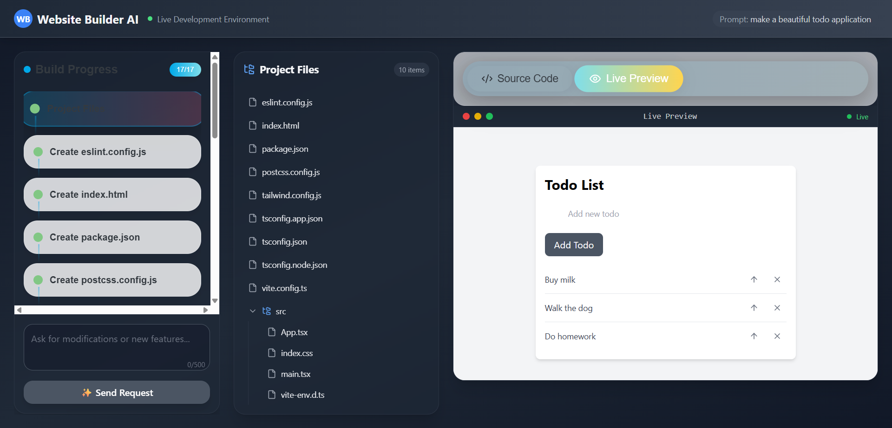

<p align="center">
  
</p>

# Code Craft

**Code Craft** is a next-generation, AI-powered website builder that empowers users to generate, preview, and explore modern web projects effortlessly. Built with a robust frontend stack—React, TypeScript, Vite, and Tailwind CSS—Code Craft delivers a seamless, interactive, and visually stunning user experience. The frontend communicates with an intelligent backend to transform natural language prompts into complete, ready-to-run web projects.

---

## ✨ Features

- **AI-Powered Website Generation:**
  - Describe your desired website in plain language and let Code Craft generate a complete, production-ready project structure—including all code files, configuration, and build steps.
- **Step-by-Step Build Visualization:**
  - Track the entire project generation process with an interactive, real-time steps list, making the workflow transparent and easy to follow.
- **Integrated File Explorer & Code Viewer:**
  - Browse, open, and view generated project files with syntax highlighting powered by Monaco Editor for a professional development experience.
- **Live Preview with WebContainer:**
  - Instantly preview your running website in a secure, isolated in-browser Node.js environment using WebContainer technology—no local setup required.
- **Modern, Responsive UI:**
  - Enjoy a visually engaging, accessible interface designed with Tailwind CSS and Lucide icons, optimized for all devices.
- **Custom Hooks & Extensible Architecture:**
  - Built with reusable components and custom React hooks for maintainability and scalability.
- **Seamless API Communication:**
  - Fast, reliable communication with the AI backend using Axios for a smooth user experience.

---

## 🖼️ Step-by-Step Screenshots

Below is a step-by-step visual guide to using Code Craft:

### 1. Home Page — Enter Your Prompt


### 2. Build Progress — Project Generation


### 3. Source Code View — Explore Generated Files


### 4. File Explorer — Browse Project Structure


### 5. Live Preview — See Your Website Instantly


### 6. Modify or Add Features — Request Enhancements


---

## 🛠️ Tech Stack

- **React 18 & TypeScript:** Modern, type-safe UI development for robust and maintainable code.
- **Vite:** Ultra-fast development server and build tool for instant feedback and optimized production builds.
- **Tailwind CSS:** Utility-first CSS framework for rapid, responsive, and consistent styling.
- **@webcontainer/api:** Enables in-browser Node.js environments, allowing live project previews without leaving the browser.
- **Monaco Editor:** Advanced code editor with syntax highlighting and rich editing features.
- **Axios:** Promise-based HTTP client for seamless API communication.
- **Lucide React:** Beautiful, customizable icons for a modern UI.

---

## 📁 Project Structure

- `src/pages/` — Main application pages (e.g., Home, Builder)
- `src/components/` — Reusable UI components (CodeEditor, FileExplorer, PreviewFrame, etc.)
- `src/hooks/` — Custom React hooks (e.g., useWebContainer)
- `src/types/` — TypeScript type definitions
- `src/steps.ts` — XML parsing and step extraction logic
- `src/config.ts` — API endpoint configuration

---

## 🚀 Getting Started

1. **Clone the repository:**
   ```sh
   git clone https://github.com/Nafiziqbal-Perdita/Code_Craft_UI.git
   cd Code_Craft_UI/frontend
   ```
2. **Install dependencies:**
   ```sh
   npm install
   ```
3. **Start the development server:**
   ```sh
   npm run dev
   ```
4. **Open [http://localhost:5173](http://localhost:5173) in your browser.**

> **Note:**
> - This frontend requires the backend server to be running. You can find the backend repository here: [Code Craft Backend](https://github.com/Nafiziqbal-Perdita/Code_Craft_server.git)

---

## 📄 License

This project is licensed under the MIT License. See the [LICENSE](LICENSE) file for details.

---

## 🤝 Contributing

Contributions are welcome! Please open an issue or submit a pull request for any improvements or bug fixes.

---

## 🌟 Acknowledgments

- Inspired by modern web development tools and frameworks.
- Special thanks to the open-source community for their amazing contributions.
